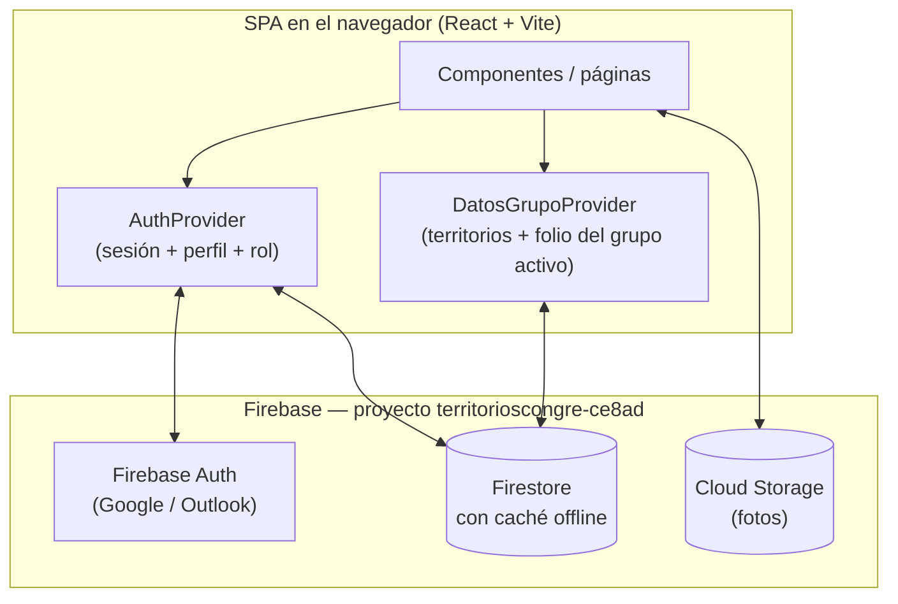
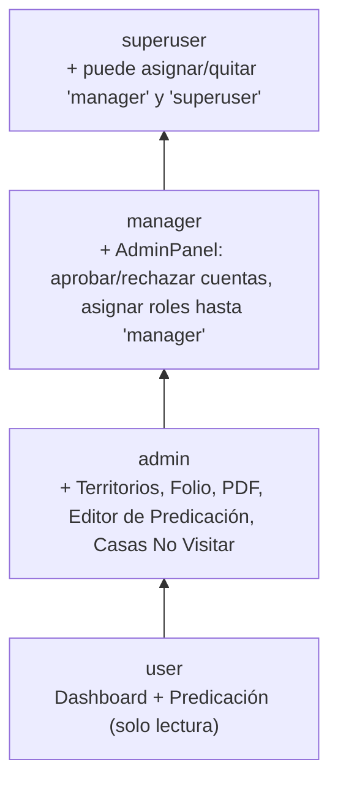
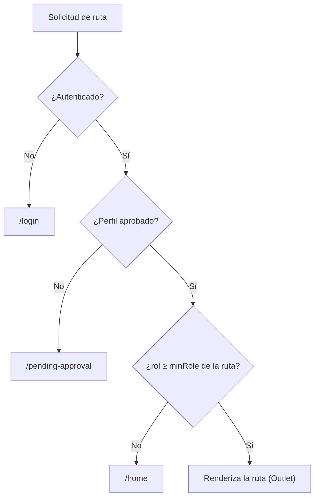
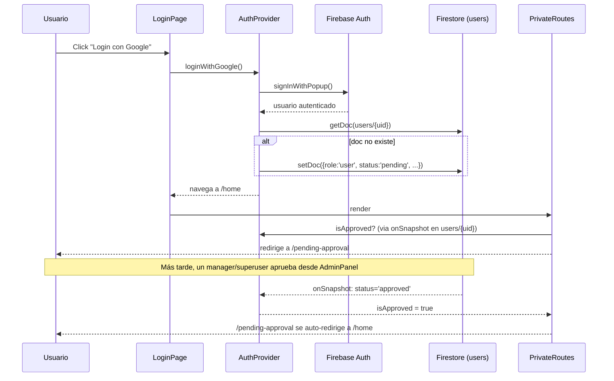
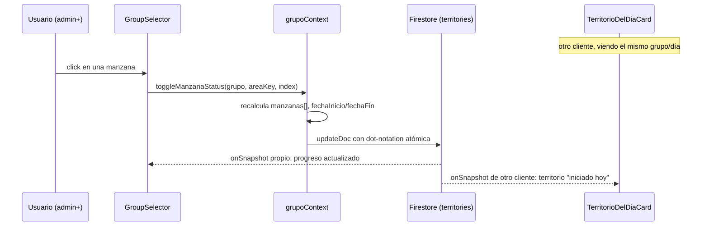
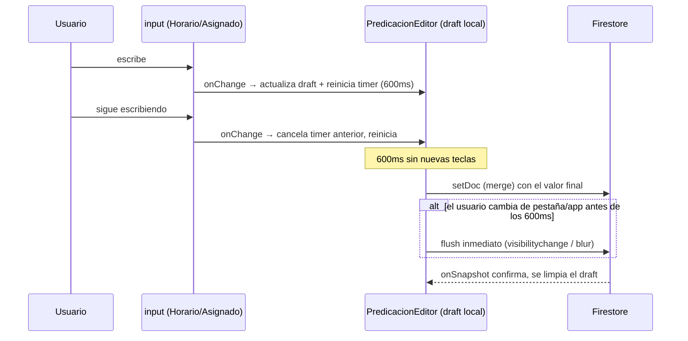
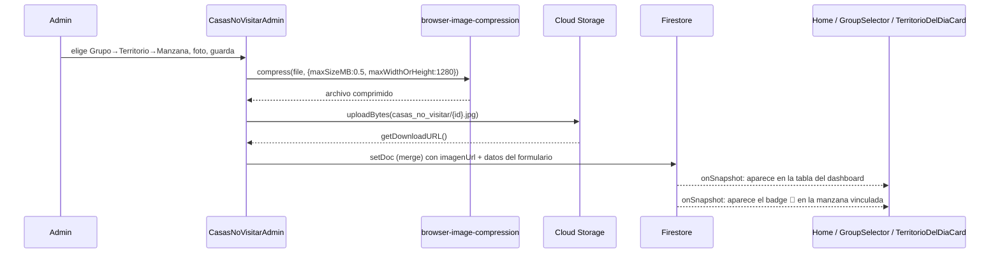
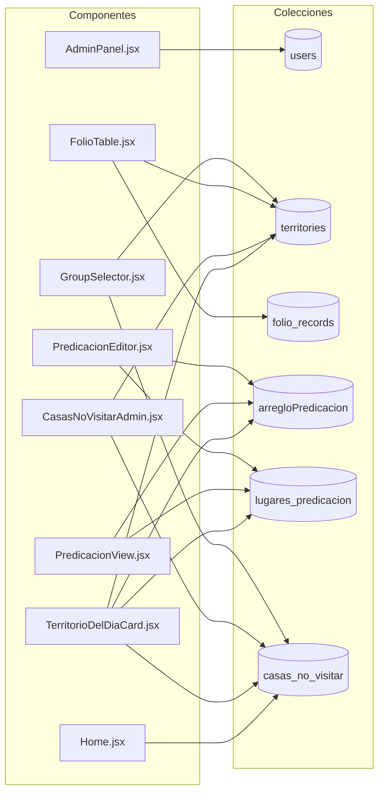

# TerritoriosApp — Documentación técnica

Referencia de arquitectura para quien retome este proyecto: qué hace, cómo está construido, cómo
fluyen los datos, y los patrones que ya están establecidos en el código. No duplica el contenido de
otros documentos del repo — los complementa:

- [`AUDIT.md`](../AUDIT.md) — auditoría de bugs y mejoras pendientes (código heredado).
- [`REACT_REVIEW.md`](../REACT_REVIEW.md) / [`error_learnings.md`](../error_learnings.md) — revisión y lecciones de una fase anterior del proyecto.
- [`CHANGELOG.md`](../CHANGELOG.md) — historial de cambios de una rama anterior.
- [`docs/push-notifications-plan.md`](push-notifications-plan.md) — spec lista para construir, aún no implementada.

## Resumen

Aplicación web para que una congregación gestione sus territorios de predicación puerta a puerta:
qué manzanas de cada territorio ya se recorrieron, el libro de registro histórico (formulario
S-13-S), el arreglo semanal/mensual de predicación, un directorio de lugares con enlace a Google
Maps, y un listado de casas que no deben visitarse (con foto). Todo con control de acceso por
niveles de rol y un flujo de aprobación para cuentas nuevas.

## Stack

| Capa | Tecnología |
|---|---|
| Build/dev server | Vite 5 + `@vitejs/plugin-react-swc` |
| UI | React 18, React Router v6, HeroUI (`@heroui/react`), Tailwind CSS |
| Backend | Firebase: Auth, Firestore (con caché local offline `persistentLocalCache`), Cloud Storage |
| PDF | `pdf-lib` (generación), `pdfjs-dist` (visualización) |
| Imágenes | `browser-image-compression` (compresión 100% en el navegador antes de subir) |
| Sin TypeScript, sin suite de tests, sin `firestore.rules` (control de acceso solo del lado del cliente) | |

## Estructura del repositorio

```
src/
  App.jsx                     Rutas y guardas de acceso
  main.jsx                    Punto de entrada (HeroUIProvider + StrictMode)
  components/
    AuthProvider.jsx           Contexto de sesión: Firebase Auth + perfil de Firestore + roles
    PrivateRoutes.jsx          Guarda de rutas (auth, aprobación, rol mínimo)
    PendingApproval.jsx        Pantalla para cuentas pendientes/rechazadas
    LoginPage.jsx               Login Google/Outlook (+ botones de prueba solo en dev)
    NavbarApp.jsx / FooterNavbar.jsx   Navegación, condicionada por rol
    Home.jsx                    Dashboard
    TerritorioDelDiaCard.jsx     Card "qué territorio toca hoy" (ver Flujos)
    GroupSelector.jsx           Ver/editar territorios y manzanas de un grupo
    GroupSelectorRenamer.jsx     Herramienta para renombrar/mover un documento de grupo
    FolioTable.jsx               Editor del libro mayor S-13-S
    PDFVisualizer.jsx / PDFPageInfoEdit.jsx / PdfEditor.jsx / PDFCanvasViewer.jsx   Generación/visualización de PDF
    PredicacionEditor.jsx        Editor del arreglo semanal/mensual + catálogo de lugares
    PredicacionView.jsx          Vista de solo lectura del arreglo de predicación
    CasasNoVisitarAdmin.jsx      Gestión de casas no visitar (con foto)
    ImagePreviewModal.jsx        Modal compartido para ver fotos en la misma app
    AdminPanel.jsx               Gestión de usuarios: aprobar/rechazar, asignar roles
    AuthUserService.jsx          Helpers puntuales de lectura/escritura sobre `users/{uid}`
    firebase.jsx                 Inicialización de Firebase + `COLLECTIONS` (modo prueba)
    contexts/grupoContext.jsx    Contexto de datos de territorios/folio del grupo seleccionado
    utils/
      _utils.js                  Datos semilla de territorios (plantilla, no la fuente de verdad)
      userAccess.js               Jerarquía de roles y helpers de permisos
      useRememberRoute.js          Recordar/restaurar la última ruta visitada
docs/
  ARCHITECTURE.md (este archivo)
  push-notifications-plan.md
```

## Arquitectura general



No hay backend propio: todo el acceso a datos ocurre directo desde el cliente contra el SDK de
Firebase. No existen reglas de seguridad de Firestore/Storage (`firestore.rules` no está en el
repo) — el control de acceso descrito abajo es **solo del lado del cliente**, ver
[`AUDIT.md`](../AUDIT.md) para el detalle de esa limitación.

## Modo prueba (`IS_TEST_MODE`)

`firebase.jsx` define `COLLECTIONS`, un mapa de nombre lógico → nombre real de colección. La
mayoría de las entradas cambian de sufijo según `IS_TEST_MODE`:

```js
TERRITORIES: IS_TEST_MODE ? 'territories_test' : 'territories',
```

`USERS` es la **única excepción** — siempre `'users'`, sin importar el modo, para que los roles y
el estado de aprobación sean los mismos en desarrollo y producción. `IS_TEST_MODE` se cambia a
mano antes de cada `firebase deploy` (no hay `predeploy` hook en `firebase.json`) — es el paso más
fácil de olvidar, revisar siempre antes de desplegar.

## Modelo de datos (Firestore)

| Colección | Forma (resumen) | Quién la usa |
|---|---|---|
| `users` | `{ name, email, role, status, createdAt, territorio, horario }` — perfiles legacy no tienen `role`/`status` (ver Roles) | `AuthProvider`, `AdminPanel` |
| `territories` | Un doc por grupo (`Murillo`, `Jara`, …): `{ name, mapa: { imagen, area: { [key]: { name, fechaInicio, fechaFin, user, manzanas: [{name, completed}] } } } }` | `GroupSelector`, `TerritorioDelDiaCard`, `CasasNoVisitarAdmin` |
| `folio_records` | Un doc plano por asignación histórica: `{ grupo, territorioNumero, publicador, fechaInicio, fechaFin, yearServicio, completado }` | `FolioTable`, `PDFVisualizer` |
| `arregloPredicacion` | Docs `semanal_*` (`{ tipo:'semanal', dia, horario, lugarId, asignado }`) y `mensual_*_{orden}` (`{ tipo:'mensual', dia, orden, grupos, lugarId, asignado }`) — un sábado puede tener 1 o 2 `orden` (ver Flujos) | `PredicacionEditor`, `PredicacionView`, `TerritorioDelDiaCard` |
| `lugares_predicacion` | `{ nombre, mapsUrl }` | `PredicacionEditor` (CRUD), `PredicacionView`/`TerritorioDelDiaCard` (lookup por `lugarId`) |
| `casas_no_visitar` | `{ etapa, mz, villa, ref, fecha, grupo, territorioKey, manzanaName, imagenUrl }` — `etapa`/`mz` son legado (ver abajo); `grupo`/`territorioKey`/`manzanaName` vinculan a un territorio real | `CasasNoVisitarAdmin` (CRUD), `Home`, `GroupSelector`, `TerritorioDelDiaCard` (lectura) |

**Nota sobre `casas_no_visitar`**: los 19 registros originales (hardcodeados antes en `Home.jsx`)
usan una numeración de "etapa" que no corresponde al modelo actual de grupo/territorio/manzana —
se migraron con los campos de vínculo en blanco, para completarlos manualmente desde
`CasasNoVisitarAdmin.jsx` según se van identificando.

Cada colección (salvo `users`) usa datos independientes en modo prueba — al desplegar con
`IS_TEST_MODE = false`, `lugares_predicacion`/`arregloPredicacion`/`casas_no_visitar` reales
empiezan vacíos hasta que se cargan datos reales desde la app ya desplegada.

## Sistema de roles y aprobación



Reglas clave (`utils/userAccess.js`):
- **Perfiles legacy** (creados antes de este sistema, sin `status`/`role`): se tratan como
  **aprobados** y con rol **`admin`** si su antiguo campo `roles` incluía `"admin"` — así ninguna
  cuenta existente queda bloqueada por la migración.
- **Cuentas nuevas**: `AuthProvider.ensureUserDoc` crea el perfil con `role:'user', status:'pending'`
  — sin acceso hasta que un `manager`/`superuser` lo apruebe desde `AdminPanel`.
- `canAssignRole`: un `manager` puede asignar cualquier rol hasta `manager` inclusive, pero nunca
  puede tocar a alguien que ya es `superuser` ni asignar ese rol — solo un `superuser` puede crear
  o modificar a otro `superuser`.

## Rutas y guardas de acceso

`PrivateRoutes.jsx` recibe una prop `minRole` (por defecto `'user'`) y se reutiliza en tres bloques
de rutas dentro de `App.jsx`:



| Ruta | `minRole` | Componente |
|---|---|---|
| `/`, `/home` | `user` | `Home` |
| `/predicacion` | `user` | `PredicacionView` |
| `/grupo` | `admin` | `GroupSelector` |
| `/foliotable` | `admin` | `FolioTable` |
| `/grouprenamer` | `admin` | `GroupSelectorRenamer` |
| `/pdfvisualizer`, `/pdfpageinfoedit` | `admin` | `PDFVisualizer`, `PDFPageInfoEdit` |
| `/predicacioneditor` | `admin` | `PredicacionEditor` |
| `/casasnovisitar` | `admin` | `CasasNoVisitarAdmin` |
| `/adminpanel` | `manager` | `AdminPanel` |
| `/login` | pública | `LoginPage` |
| `/pending-approval` | autenticado (sin exigir aprobación) | `PendingApproval` |

`PendingApproval` se auto-redirige a `/home` si el perfil resulta aprobado mientras está montado —
protección contra que un falso negativo momentáneo (ver Flujos, cache de Firestore) deje a alguien
atascado ahí.

`useRememberRoute()` guarda la última ruta visitada en `sessionStorage`; si la app carga
directamente en `/`, restaura esa ruta en vez de mostrar siempre el dashboard — pensado para
cuando el sistema operativo recarga la pestaña/PWA en segundo plano.

## Flujos clave (diagramas de secuencia)

### 1. Login y aprobación de una cuenta nueva



### 2. Marcar una manzana como completada



### 3. Edición con debounce en el arreglo de predicación



### 4. Registrar una casa no visitar con foto



## Quién lee qué colección



## Patrones establecidos (seguir para código nuevo)

- **Helpers pequeños duplicados por archivo** en vez de un util compartido: `formatDate`,
  `getSaturdays`, etc. aparecen casi idénticos en varios componentes a propósito — es la
  convención ya asentada en este repo, priorizando simplicidad sobre DRY para funciones triviales.
- **Lecturas independientes por componente**: componentes como `TerritorioDelDiaCard` o el badge de
  `GroupSelector` hacen su propio `onSnapshot`/`getDoc` en vez de pasar por `grupoContext`, porque
  necesitan datos de un grupo que puede no ser el `nombreGrupo` seleccionado en ese momento (el
  grupo del día no tiene por qué coincidir con el grupo que el usuario tiene abierto en pantalla).
  `grupoContext` sigue siendo la fuente para todo lo relacionado al grupo activo/seleccionado.
- **Modo de prueba para cuentas** (`AuthProvider.loginAsTestUser`): en `import.meta.env.DEV`,
  `/login` muestra botones para entrar como cada nivel de rol sin pasar por OAuth — escribe
  perfiles reales en Firestore (`test-user`, `test-admin`, etc.), útil para probar permisos sin
  crear cuentas de Google reales. Se elimina del bundle de producción (Vite descarta ese código al
  compilar con `import.meta.env.DEV = false`).
- **Debounce + flush en inputs de texto ligados a Firestore**: ver Flujo 3 — patrón a repetir si se
  agregan más campos de texto que escriban en cada tecla.
- **Modal de foto compartido** (`ImagePreviewModal.jsx`): cualquier lugar nuevo que muestre una foto
  debería reutilizar este componente en vez de abrir la imagen en una pestaña nueva.

## Limitaciones conocidas

- **Sin reglas de seguridad de Firestore/Storage** — el control de acceso descrito arriba es solo
  de UI/rutas; cualquier usuario autenticado podría, en teoría, llamar a Firestore directamente
  desde la consola del navegador y saltarse los chequeos de rol. Ver `AUDIT.md`.
- **Sin notificaciones push todavía** — diseño completo en
  [`docs/push-notifications-plan.md`](push-notifications-plan.md), pendiente de Cloud Functions +
  plan Blaze.
- **Sin suite de pruebas automatizadas** — toda verificación es manual (ver notas de verificación
  en cada plan/feature de este repo).
